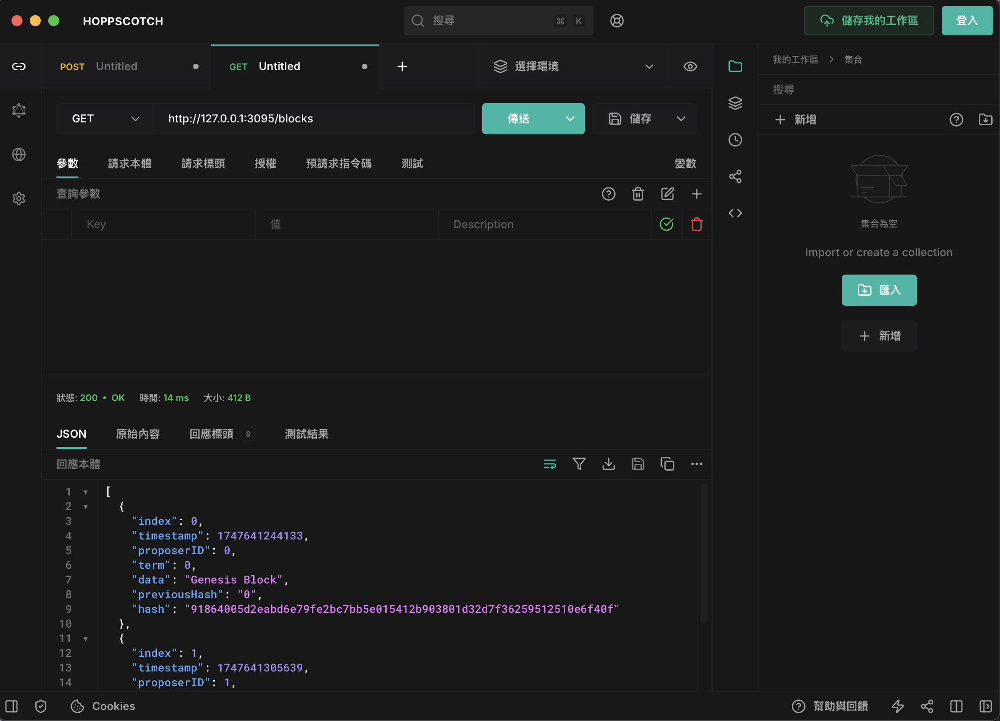

# Raft based Blockchain

基於Raft共識演算法打造的高效區塊鏈系統，旨在提供更為可靠、安全與去中心化的分佈式資訊共享解決方案。透過一致性機制確保網絡中的節點在面對故障或攻擊時，仍能保持一致性與數據完整性。

## 壹、基本說明
**一、目標：**
由於Raft演算法提供了卓越的高可用性、強大的容錯性、靈活的擴展性以及堅如磐石的一致性，它成為實現穩定且可靠的分散式系統和區塊鏈應用的理想選擇。在這一技術基礎之上，該程式能夠在需求高效運行的同時，無論面對節點故障或網絡異常等情況，依然保持系統的穩定性與數據的一致性，從而確保無論外部環境如何變化，系統始終可靠地運行。
<br>

**二、開發環境：**
以下是開發該平台所採用的環境：
* 虛擬機：Docker（創建多個容器以模擬實際的分佈式系統環境，從而為開發過程提供真實的測試場景）
* 程式語言：JavaScript
* JavaScript執行環境：Node.js
* Node.js資源管理工具：npm
* 程式編輯器：Visual Studio Code

**三、使用相依套件：**
以下是開發該平台所使用的Node.js套件：
* express（Web應用程式架構）
* axios（API請求）
* crypto（加密技術）
* cors (跨來源資源共用)

## 貳、操作說明
**一、安裝程式方式：** 
請從GitHub下載raft.js檔案，並將其部署於各個分佈式系統節點中，具體操作步驟如下所示：
1. 安裝Node、NPM
2. 創建一個資料夾，建立專案
```bash
mkdir <資料夾名稱>
cd <資料夾名稱>
npm init -y
```
3. 安裝套件
```bash
npm install express
npm install axios
npm install cors
npm install nodemon
```
4. 設定各個分佈式系統節點資訊（請至程式最下方的啟動節點）
```bash
const node = new Node(本地分佈式系統節點編號, 本地分佈式系統節點Port, { 第一台分佈式系統節點編號: "第一台分佈式系統節點IP:第一台分佈式系統節點Port", 第二台分佈式系統節點編號: "第二台分佈式系統節點IP:第二台分佈式系統節點Port" });
```

**二、運行結果：**
系統建置完成後，請啟動各個分佈式系統節點，開始運行。
```bash
nodemon raft.js
```

**三、對Node的RESTful API請求：** 
以下是本系統平台所提供的RESTful API，您可以利用這些端點對任意節點進行資料提交與區塊鏈查詢。接下來將詳細列出對應的HTTP方法、路徑及參數說明，具體內容如下：
* `POST` /appendBlockToNode：用戶向節點發送要創建區塊的訊息（請求內容有data）
* `GET` /blocks：獲取整個區塊鏈
<br>
1. 新增資料
<br>
  <div align="center">
  	
  </div>
<br>
2. 查詢區塊鏈
<br>
  <div align="center">
  	
  </div>
<br>
   
## 參、未來規劃
本次實作已成功實現基本區塊鏈數據的一致性。然而，若節點長時間處於離線狀態，未能及時接收到領袖節點發送的追加區塊，則該節點將無法在後續進行區塊更新，這部分問題將在未來進行優化和改進。
